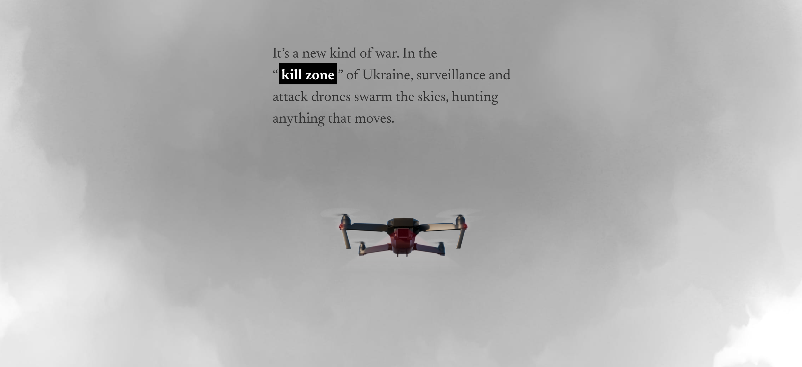
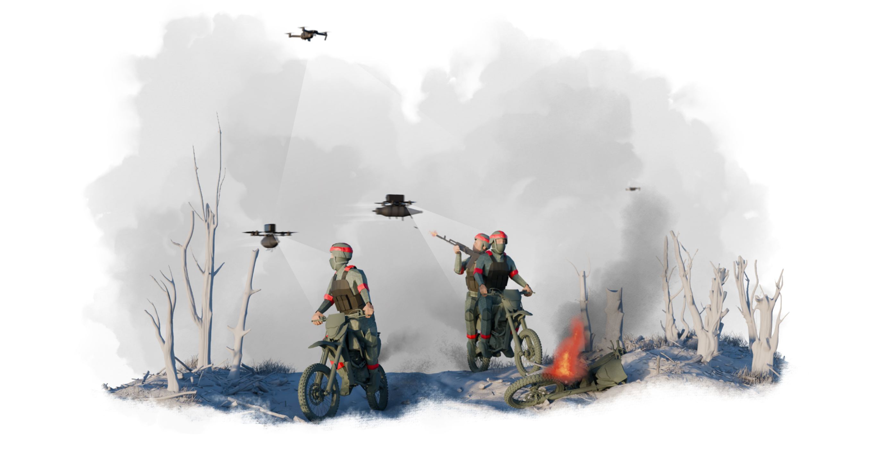

# Inside Ukraine’s Kill Zone (Reuters Graphics)
Link: https://www.reuters.com/graphics/UKRAINE-CRISIS/KILL-ZONE/znpnojmknvl/ 

## Descripción de la historia 
El reportaje de Reuters explica cómo la expansión masiva de drones (naves no tripuladas) que cada vez tienen un valor económico más bajo, han cambiado la forma de entender la guerra moderna y sus tácticas en el escenario de la guerra Rusia-Ucrania. 

## Lo cautivador del relato
La manera de contar la historia es dinámica y aunque no es tan interactiva (lo que de cierta forma veo positivo y rescataré ese punto más adelante), es envolvente y cautivadora. Me hace recordar a reportajes audiovisuales del canal History por la inmersión que provoca por medio de la mezcla de datos, lo interesante de la información y la demostración gráfica. Al no ser interactivo, permite disfrutar de una experiencia lineal, sin perder tiempo en explorar y adquiriendo nueva información de manera "entretenida" (lo pongo entre comillas por que no es, obviamente, entretenido la muerte de soldados ucranianos por medio de naves aéreas no tripuladas) y rápida. Algunas veces se intenta hacer tan libre la experiencia con gráficos que te llevan de un lugar a otro o hipervínculos que quitan el foco de lo importante, que aunque lo veo interesante para explorar por recreación como suele ser cuando entramos a Wikipedia, el poder estar frente a una web que me promete algo al principio (aprender sobre la zona de muerte en la guerra y su relación con los drones) y que lo cumple al final de manera satisfactoria y rápida es gratificante. 

Si nos vamos a lo práctico del relato, su manera de aterrizar un conflicto que es conocido en cuanto a lo macro, pero no en su totalidad si queremos ver lo micro, es un acierto. Poco a poco nos adentra en una historia con la que somos capaces de conectar como si fuéramos unos niños. Lo anterior, lo digo principalmente porque al hacer scroll (lo vemos al principio), la web interactúa con nosotros haciéndonos parte de la historia sin abrumarnos con excesos visuales. Por otro lado, las imágenes realmente no son tal. El texto se integra en el fondo dándonos una forma de consumir noticias o textos informativos de una manera mucho más digerible lo que es deseable no sólo por los aspectos positivos que tiene el infoentretenimiento en nuestra sociedad sino por la capacidad de este tipo de construcción de relatos para democratizar la información en áreas tan importantes como lo es esta guerra.  
Volviendo a la experiencia de usuario, el tener que sólo hacer scroll para informarme por completo reduce las fricciones dentro de la página que se crean con, por ejemplo, el uso de clics para desplegar información. Lo que es bastante inteligente o provechoso sabiendo que nuestro público puede ser, potencialmente, personas jóvenes que están permanentemente expuestas a redes sociales como tiktok en donde la retención es cada vez menor. Es imposible no destacar la linea de arriba de la página que va marcando en qué parte del territorio nos encontramos (mientras más bajamos va pasando desde territorio ruso, la zona gris entre ambos, y territorio ucraniano).

## Efectividad para transmitir información
Uno de los puntos más fuertes de la web es transformar datos crudos y quizás difíciles de digerir, en una narrativa visual accesible para un abanico de público muy amplio (como lo expliqué más arriba). Por supuesto que Reuters tiene una calidad y tratamiento de datos excepcional y utiliza fuentes confiables como el Instituto para el estudio de la guerra y el "AEI Critical Threats Project". 
Respecto al equilibrio entre el texto y lo visual, es un trabajo armónico ya que lo que debiera o podría ser explicado con demasiado detalle para poder ser entendido, es delegado al apartado gráfico. El texto es conciso y directo actuando como el hilo conductor para una historia que se explica mayoritariamente de manera gráfica. 
Tiene una gran efectividad comunicacional (logra comunicar lo que quiere) gracias a su formato que sumerge al lector y quita fricciones. La lectura lineal nos mantiene enfocados exclusivamente en la progresión del relato (acompañado por esa línea de arriba que marca la zona en la que nos encontramos). 

Juan Tapia
Juan.tapia@uc.cl
